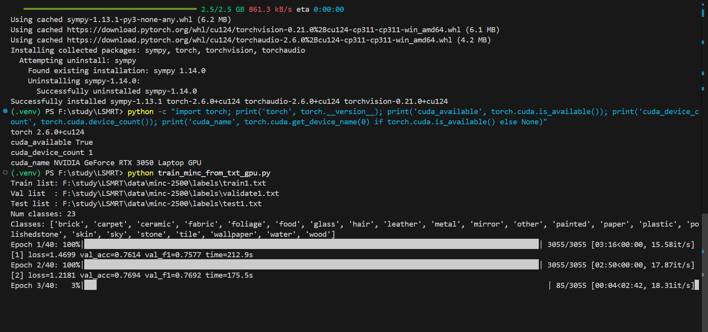

# 基于智能手机摄像头与IMU的轻量表面材质识别技术研究
```
研究通过智能手机的摄像头（拍摄表面纹理）与IMU（记录触摸时的微振动） 进行多模态融合，实时识别接触表面的材质类别。
进一步，研究基于少量样本的快速适配机制，实现可迁移、可快速适配、低延迟的多模态材质识别方法。
为机器人操作、具身智能交互提供实时、可靠的材料感知支持。
（1）多模态的材质表征学习：构建一个深度学习模型，从单帧表面图像与短时序IMU微振动信号中学习联合表征，实现高精度的材质分类。
（2）新设备的快速适配：用少量样本快速适配设备，提升在迁移到新设备上时的识别准确度。
（3）低延迟端侧部署优化：将整个识别与反馈生成管道优化并部署到智能手机上，实现端到端延迟低于50ms的实时体验，满足交互需求。
```

- 表征学习/对齐/迁移
    - IMU encoder 预训练、图像 encoder 预训练
  - 再用少量自己采集的 paired 数据做对齐（对比学习）或小样本适配

## 设置

- 激活/退出虚拟环境
    ```
        .\.venv\Scripts\activate
        deactivate
    ```                     
- python : 3.11.4 (tags/v3.11.4:d2340ef, Jun  7 2023, 05:45:37) [MSC v.1934 64 bit (AMD64)]
- numpy  : 1.26.4
- pandas : 2.1.4
- torch+本地cuda
    torch2.6.0 + cu124
    

- 解析pickle文件
    - conda activate pkl_convert
    - conda deactivate  
    - python3.6 numpy 1.16.6 pandas 0.20.3

- conda activate lsmrt_py311
- conda deactivate  

## 图像分支
- dataset:MINC-2500(Materials in Context Database)
- 5 个 split 是 5 组不同的数据划分
- 23类材质不用都做，做容易摸得着的材质，wood, metal, plastic, glass, paper, fabric, leather, stone, ceramic, rubber, carpet…（按 IMU 数据集类别对齐）

- MobileNetV3-Large 的核心特点：
    - 面向移动端/轻量计算：参数量和 FLOPs 较小。
    - 以 **深度可分离卷积**（Depthwise Separable Conv）为主，降低计算量。
    - 关键模块是 **倒残差结构（Inverted Residual）+ SE 注意力（Squeeze-and-Excitation）**：
        - 倒残差：先升维（expand）→ 深度卷积 → 再降维（project），在保证表示能力的同时更省算力。
        - SE：对通道做“全局池化→两层 MLP→sigmoid”，给每个通道一个权重，实现通道注意力。
    - 使用更适合移动端的激活函数（如 Hard-Swish/Hard-Sigmoid）。

- 数据增强 / 预处理
    - 训练集 train_tf：Resize → RandomHorizontalFlip → ColorJitter → RandomGrayscale → ToTensor → Normalize
    - 验证/测试 test_tf：Resize → ToTensor → Normalize

- best.pt：训练过程中，在验证集（validate）上表现最好的那一版模型快照
    - test_best_pt.py：加载 best.pt，用 test.txt 的数据，算最终 test_acc / test_f1
- 指标：Loss, Val_Acc, Val_F1, Time(s)

- MobileNetV3 baseline:分辨率224*224, mnv3 large, split1
- 分辨率消融：224 vs 192 vs 160
    - IMG_SIZE 决定了：感知尺度 + 计算量 + 延迟, 直接决定模型“能看到多细的纹理”。高分辨率图像包含更丰富的纹理、边缘和局部结构信息
    - IMG_SIZE = 计算量
    - 消融实验必须在同一数据划分上做
- 模型大小消融：MobileNetV3-Large vs MobileNetV3-Small
    - Large 是“性能优先”，Small 是“极致端侧轻量优先”
    - Small 模型的 embedding 表达能力更弱，Small + IMU 的融合增益，往往比 Large + IMU 更明显

<!-- - 统计稳定性评估 → 固定模型，换 split -->

- MobileNetV3-Small @ s192  resize
    - 目的：给端侧一个更轻的选项，看是否“更快但精度几乎不掉”。
    - 结果：速度快了，精度掉了将近4%

- MobileNetV3-Large@192 + strong_aug（RandomResizedCrop）
    - 用 RandomResizedCrop 替代纯 Resize（纹理任务常有效），并比较提升幅度。
    - Large@192 + strong_aug（RandomResizedCrop）
    - 之前的增强是 Resize + ColorJitter + Gray + HFlip，对纹理不一定最合适。RandomResizedCrop 会明显提升泛化，尤其 MINC 这种数据。
    - strong_aug：
        - RRC scale=(0.6,1.0)
        - RRC scale=(0.75, 1.0)
        - RRC scale=(0.8, 1.0)

- EfficientNet-B0 @ s192  (精度上限)
    - 目的：在轻量范围内尝试更强 backbone，看看能不能把 s192 精度拉近/超过 s224 的 0.815。
    - EffB0@192 + resize：test_acc 0.8237
    - MNV3-Large@192 + rrc0.8：test_acc 0.8061
    - 提升 1.76%（macro_f1 也同步提升），而且 EffB0 仍然是轻量模型，作为后续融合的图像编码器非常合适。


## IMU分支
- multimodal-tactile-texture-dataset
    - full_imu（包含 9 维 MARG：加速度/角速度/磁场）+ full_baro。
    - 文件名也编码了texture id 和 episode id（比如 imu_0101.pkl）。数据是 12个纹理 × 3个速度(30/35/40) × 每种100次 episode = 3600次 episode。
    - 纹理包括塑料铅笔盒、塑料餐垫、软木塞、牛仔布、毛毡、聚酯布和棉质围巾等各种物品

- X: (893766, 256, 9)，这基本是所有窗口堆叠后再 split。 这会导致：
    - 同一条 imu0101.pkl 产生的很多窗口，被随机分到 train/val/test
    - 测试集包含训练集的“近重复片段”
    - 指标虚高（尤其这种纹理 IMU 信号周期性很强）

- pkl → npz
    - 最初版本：pkl->npz。存在“窗口级数据泄漏”问题（同一条原始 imu trial 被切成大量重叠窗口，随机划分时相邻窗口会同时进入 train/val/test，模型等于“见过”测试样本的近邻）。
    - 生成带 gid 的 NPZ
    - 


- trial-level split 的定义（按论文语境也叫 episode-level）：
    - 一个 .pkl 文件就是一次 exploratory episode（trial）
    - A multimodal tactile dataset fo…
    - 你滑窗得到的所有 window 必须绑定在该 trial 上
    - 划分 train/val/test 时，必须按 trial 划分，而不是按 window
    - 两遍扫描：先统计总窗口数，再 memmap 写入（不会爆内存）
    - 生成：
        - X.npy (memmap) 形状 (N, win, 9)
        - y.npy 形状 (N,)
        - trial.npy 形状 (N,)：每个 window 属于哪个 trial
        - vel.npy 形状 (N,)
        - trials.csv：trial 元信息（速度、纹理、episode、源文件）
        - train_idx.npy / val_idx.npy / test_idx.npy：最终窗口级索引（保证 trial 不泄漏）


- IMU NPZ 训练脚本
    - “随机打散所有窗口再 8/1/1 划分”（train_imu_npz_cli.py脚本里也写了baseline only的提示），属于窗口级划分，这在时间序列切窗任务里通常会高估性能。是这么做的：先 permutation(N) 再切分。
    - 严谨划分：trial-level split（按原始 pkl 文件划分）   目标：同一个 pkl（一次采集 trial）产生的所有窗口必须全部只落在train或val或test之一。


- 窗口参数消融：
    - win ∈ {128, 256, 512}；stride ∈ {win/4, win/2}
- 模型消融（同一 split 下对比）
    - 1D-CNN（你现在这个）
    - TCN（更强）
    - CNN+GRU（更强）


- 路线 A vs B：做“材质表征”还是先做“同步采集的图像+IMU分类”？
    - 你的第一步目标是「从单帧图像 + 短时序 IMU 学联合表征，实现高精度材质分类」。在这个目标下：
- 我建议先走路线 B（更工程、更可控）：
    - 先把“同步采集的图像+IMU”数据集跑通（哪怕规模小），你能完整验证：
    - IMU 分支能学到区分性（你已经到 0.94 了，很好）
    - 图像分支能学到区分性（MINC-2500 你在 0.81～0.82）
    - 融合后是否提升、是否鲁棒、是否速度变化/方向变化影响明显

    - 路线 A（更自然：学表征而非标签分类）适合做成“第二阶段强化”：
    - 用 self-supervised / contrastive（例如 SimCLR/BarlowTwins）在 IMU 上学表示
    - 或跨模态对齐（image ↔ imu 的对比学习）
    - 但前提是你得先有同步对齐数据，否则会变成“跨数据集迁移/域适配”的大坑（论文工作量会飙升）。


现在这两个数据集**不是同步采集**，所以多模态只能做“表征/检索/迁移”式的融合实验，而不是“同一样本融合分类”。


## 回到你最本质的问题：路线 A 还是 B？
> **路线 A（更自然）：材质表征学习**
> **路线 B（更工程）：同步图像+IMU 分类**
---

### 🎯 你的正确路线是：
## **A → B（不是二选一，是阶段式）**
### **阶段 1（你现在正处于的阶段）**

* IMU-only
* Trial-level split ✔
* Cross-velocity generalization ✔
* 目标：**学习“速度不变”的材质表征**


### **阶段 2（下一步）**

* Image-only（你 MINC 82% 那条线）
* 同样做 **trial / patch-level split**
* 得到 image embedding


### **阶段 3（最终，多模态）**

* 不要求 image & IMU 同步采集
* 用 **late fusion / contrastive alignment / shared embedding space**
* 做：

  * material retrieval
  * cross-modal recognition
  * robustness analysis（IMU 抗光照，image 抗噪声）

👉 这条路线**完全是顶会可接受的多模态定义**


